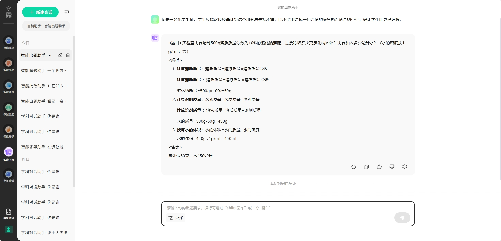

# SCWX_LM

<p align="center">
    
<p>

<p align="center">
    &nbsp;&nbsp;&nbsp;&nbsp;
<p>

<p align="center">
          💜 <a href="https://smartedu-bnu.tal.com/"><b>SCWX_LM Demo</b></a>&nbsp&nbsp | &nbsp&nbsp🤗 <a href="https://huggingface.co/Qwen">Hugging Face</a>
<p>

## 简介

师承万象大模型是北京师范大学和北京世纪好未来教育科技有限公司共同研发的首个紧扣新课标知识体系的基础教育大模型，确保所学知识内容与基础教育课程标准高度契合，精准对接学生核心素养培育与教师专业成长需求。在应用层面，基础教育大模型深度融合新课标理念，实现探究启发式智能答疑、素养导向型智能出题、情境沉浸式教案生成，从知识传授转向核心素养培育，助力培养全面发展时代新人。同时，师承万象大模型也是目前性能最好的开源基础教育大模型，可供开发者进一步改进，为促进基础教育智能化转型提供了基础平台。

## 能力

### 通用能力


</p>

师承万象大模型作为目前性能最好的开源基础教育大模型，保留了强大的通用对话能力，能够流畅应对日常交流、知识问答、创意生成等多样化需求。无论是闲聊互动、学习辅助，还是实用信息查询、解题，它都能以精准的理解和自然的表达提供帮助。

在专注专业领域的同时，师承万象依然保持着强大的通用能力，无论是日常交流还是复杂任务，都能为您提供智能、流畅的交互体验，让对话更高效，更自然。

### 基础能力

师承万象针对初中数学、物理、化学三大理科科目进行专项优化，能够精准解析题目、提供清晰思路，并给出详细解答步骤。

在私有解题测试数据集的评测中，各项指标均达到同量级领先水平。无论是基础题型的快速求解，还是复杂问题的多步推理，其准确性和解析质量都展现出显著优势。

### 专业能力

<details><summary><b>智能出题</b></summary>


</details>

<details><summary><b>智能答疑</b></summary>


</details>

<details><summary><b>教案生成</b></summary>


</details>

## 技术路线
todo

## 模型性能

### 通用能力

我们用师承万象与同量级领先的模型和部分闭源模型进行了基准测试。我们在多个基准测试中评估了模型的能力和人类偏好，展示了模型的通用能力。

| **Model**          | **IFEval** | **GaoKaoBench** | **CEval** | **MMLU** | **MMLU_PRO** | **GPQA** | **MATH** | **CMMLU** | **HalluQA-main** |
|--------------------|------------|-----------------|-----------|----------|--------------|----------|----------|-----------|------------------|
| Qwen2.5-14B        | 78.45      | 86.37           | 82.37     | 78.13    | 64.02        | 46.46    | 80       | 80.19     | 62.22            |
| DS_dis_qwen-14B    | 71.9       | 74.94           | 67.38     | 86.08    | 73.23        | 55.56    | 91.3     | 81.77     | 43.56            |
| scwx               | 53.23      | -               | -         | 83.94    | 67.21        | 43.43    | 82.2     | 80.87     | 71.33            |

### 基础能力

基础能力测评使用多维度结构化设计，覆盖化学、数学、物理三大基础学科，通过客观题与主观题的组合形式全面评估学生能力。

化学部分包含5个核心维度，均设置客观题和主观题双向考查：化学与社会·跨学科实践、物质的化学变化、物质的性质与应用、物质的组成与结构、科学探究与化学实验，既注重知识掌握，又强调实践应用。

数学部分分为4个核心维度：图形与几何、数与代数、统计与概率、综合与实践，每领域均配置客观题和主观题，突出逻辑推理与跨学科整合能力。

物理部分则围绕5个核心维度：实验探究、物质、能量、跨学科实践、运动和相互作用，同样采用主客观题结合。

整体模型设计兼顾知识广度与思维深度，通过题型互补实现多维诊断，适用于对模型基础解题能力的评估。


**评测结果**

<details><summary><b>数学评测结果</b></summary>

| **Model**                      | **图形与几何（客观题）** | **数与代数（客观题）** | **统计与概率（客观题）** | **综合与实践（客观题）** | **图形与几何（主观题）** | **数与代数（主观题）** | **统计与概率（主观题）** | **综合与实践（主观题）** |
|--------------------------------|--------------------------|------------------------|--------------------------|--------------------------|--------------------------|------------------------|--------------------------|--------------------------|
| DeepSeek-R1                    | 0.895                    | 0.955                  | 0.915                    | 0.93                     | 0.95                     | 0.96                   | 0.94                     | 0.89                     |
| o3-mini                        | 0.895                    | 0.92                   | 0.88                     | 0.905                    | 0.95                     | 0.96                   | 0.93                     | 0.85                     |
| DeepSeek-V3                    | 0.89                     | 0.93                   | 0.905                    | 0.915                    | 0.95                     | 0.95                   | 0.93                     | 0.88                     |
| gpt-4.1                        | 0.825                    | 0.81                   | 0.85                     | 0.84                     | 0.9                      | 0.94                   | 0.94                     | 0.85                     |
| DeepSeek-R1-Distill-Qwen-14B   | 0.785                    | 0.84                   | 0.755                    | 0.75                     | 0.82                     | 0.86                   | 0.82                     | 0.73                     |
| Qwen-14B                       | 0.775                    | 0.82                   | 0.78                     | 0.71                     | 0.81                     | 0.77                   | 0.8                      | 0.72                     |
| glm-4-9b-chat                  | 0.4                      | 0.475                  | 0.405                    | 0.37                     | 0.74                     | 0.76                   | 0.76                     | 0.6                      |
| phi-4                          | 0.575                    | 0.68                   | 0.655                    | 0.455                    | 0.81                     | 0.8                    | 0.85                     | 0.73                     |
| Baichuan2-13B-Chat             | 0.365                    | 0.395                  | 0.375                    | 0.29                     | 0.31                     | 0.44                   | 0.33                     | 0.33                     |
| internlm2-math-20b             | 0.39                     | 0.47                   | 0.43                     | 0.37                     | 0.49                     | 0.42                   | 0.43                     | 0.28                     |
| glm-4-9b-chat (重复)           | 0.4                      | 0.475                  | 0.405                    | 0.37                     | 0.74                     | 0.76                   | 0.76                     | 0.6                      |
| gemma-3-12b-it                 | 0.625                    | 0.67                   | 0.655                    | 0.545                    | 0.84                     | 0.83                   | 0.83                     | 0.69                     |
| 星火lite                       | -                        | -                      | -                        | -                        | -                        | -                      | -                        | -                        |
| Confucius                      | 0.815                    | 0.825                  | 0.79                     | 0.695                    | 0.75                     | 0.82                   | 0.71                     | 0.68                     |
| educhat-base-002-13b           | 0.125                    | 0.155                  | 0.155                    | 0.14                     | 0.14                     | 0.09                   | 0.3                      | 0.11                     |
| educhat-sft-002-13b            | 0.165                    | 0.22                   | 0.12                     | 0.17                     | 0.15                     | 0.14                   | 0.27                     | 0.16                     |
| freeze                         | 0.69                     | 0.76                   | 0.73                     | 0.63                     | 0.78                     | 0.83                   | 0.8                      | 0.7                      |
| merge                          | 0.865                    | 0.89                   | 0.87                     | 0.775                    | 0.67                     | 0.48                   | 0.68                     | 0.54                     |
| ours_3epoch_0430               | 0.775                    | 0.85                   | 0.78                     | 0.655                    | 0.86                     | 0.84                   | 0.85                     | 0.73                     |
| pt_0507                        | 0.8                      | 0.815                  | 0.775                    | 0.75                     | 0.85                     | 0.88                   | 0.87                     | 0.77                     |

</details>

<details><summary><b>物理评测结果</b></summary>

| **Model**                      | **实验探究（客观题）** | **物质（客观题）** | **能量（客观题）** | **跨学科实践（客观题）** | **运动和相互作用（客观题）** | **实验探究（主观题）** | **物质（主观题）** | **能量（主观题）** | **跨学科实践（主观题）** | **运动和相互作用（主观题）** |
|--------------------------------|------------------------|--------------------|---------------------|---------------------------|-------------------------------|------------------------|--------------------|---------------------|---------------------------|-------------------------------|
| DeepSeek-R1                    | 0.84                   | 0.91               | 0.905               | 0.88                      | 0.89                          | 0.9                    | 0.97               | 0.96                | 0.96                      | 0.97                          |
| o3-mini                        | 0.705                  | 0.865              | 0.845               | 0.79                      | 0.77                          | 0.8                    | 0.87               | 0.91                | 0.9                       | 0.89                          |
| DeepSeek-V3                    | 0.805                  | 0.875              | 0.9                 | 0.85                      | 0.87                          | 0.85                   | 0.95               | 0.95                | 0.96                      | 0.97                          |
| gpt-4.1                        | 0.63                   | 0.815              | 0.845               | 0.78                      | 0.77                          | 0.81                   | 0.9                | 0.92                | 0.93                      | 0.91                          |
| DeepSeek-R1-Distill-Qwen-14B   | 0.625                  | 0.77               | 0.8                 | 0.73                      | 0.715                         | 0.59                   | 0.82               | 0.8                 | 0.86                      | 0.86                          |
| Qwen-14B                       | 0.645                  | 0.825              | 0.815               | 0.78                      | 0.785                         | 0.68                   | 0.83               | 0.85                | 0.89                      | 0.89                          |
| glm-4-9b-chat                  | 0.41                   | 0.655              | 0.64                | 0.645                     | 0.63                          | 0.67                   | 0.87               | 0.84                | 0.88                      | 0.87                          |
| phi-4                          | 0.345                  | 0.625              | 0.66                | 0.575                     | 0.58                          | 0.55                   | 0.7                | 0.76                | 0.71                      | 0.73                          |
| Baichuan2-13B-Chat             | 0.265                  | 0.42               | 0.44                | 0.385                     | 0.425                         | 0.23                   | 0.39               | 0.41                | 0.44                      | 0.49                          |
| internlm2-math-20b             | 0.305                  | 0.42               | 0.46                | 0.375                     | 0.4                           | 0.35                   | 0.54               | 0.45                | 0.6                       | 0.59                          |
| glm-4-9b-chat (重复)           | 0.41                   | 0.655              | 0.64                | 0.645                     | 0.63                          | 0.67                   | 0.87               | 0.84                | 0.88                      | 0.87                          |
| gemma-3-12b-it                 | 0.445                  | 0.665              | 0.68                | 0.635                     | 0.59                          | 0.59                   | 0.77               | 0.79                | 0.8                       | 0.79                          |
| 星火lite                       | -                      | -                  | -                   | -                         | -                             | -                      | -                  | -                   | -                         | -                             |
| Confucius                      | 0.665                  | 0.83               | 0.855               | 0.8                       | 0.815                         | 0.7                    | 0.74               | 0.82                | 0.81                      | 0.85                          |
| educhat-base-002-13b           | 0.145                  | 0.185              | 0.2                 | 0.225                     | 0.19                          | 0.16                   | 0.24               | 0.21                | 0.29                      | 0.33                          |
| educhat-sft-002-13b            | 0.17                   | 0.165              | 0.22                | 0.17                      | 0.185                         | 0.28                   | 0.34               | 0.29                | 0.45                      | 0.38                          |
| freeze                         | 0.625                  | 0.825              | 0.85                | 0.855                     | 0.83                          | 0.67                   | 0.84               | 0.87                | 0.89                      | 0.9                           |
| merge                          | 0.78                   | 0.915              | 0.865               | 0.855                     | 0.875                         | 0.65                   | 0.83               | 0.73                | 0.88                      | 0.88                          |
| ours_3epoch_0430               | 0.765                  | 0.955              | 0.915               | 0.915                     | 0.885                         | 0.76                   | 0.91               | 0.89                | 0.93                      | 0.95                          |
| pt_0507                        | 0.675                  | 0.835              | 0.85                | 0.81                      | 0.82                          | 0.77                   | 0.9                | 0.92                | 0.92                      | 0.95                          |

</details>

<details><summary><b>化学评测结果</b></summary>

| **Model**                      | **化学与社会·跨学科实践（客观题）** | **物质的化学变化（客观题）** | **物质的性质与应用（客观题）** | **物质的组成与结构（客观题）** | **科学探究与化学实验（客观题）** | **化学与社会·跨学科实践（主观题）** | **物质的化学变化（主观题）** | **物质的性质与应用（主观题）** | **物质的组成与结构（主观题）** | **科学探究与化学实验（主观题）** |
|--------------------------------|-------------------------------------|-----------------------------|-------------------------------|-------------------------------|-----------------------------------|-------------------------------------|-----------------------------|-------------------------------|-------------------------------|-----------------------------------|
| DeepSeek-R1                    | 0.77                                | 0.87                        | 0.835                         | 0.805                         | 0.79                              | 0.92                                | 0.95                        | 0.96                          | 0.94                          | 0.86                              |
| o3-mini                        | 0.785                               | 0.8                         | 0.775                         | 0.645                         | 0.5                               | 0.84                                | 0.85                        | 0.85                          | 0.77                          | 0.76                              |
| DeepSeek-V3                    | 0.785                               | 0.815                       | 0.8                           | 0.77                          | 0.715                             | 0.89                                | 0.9                         | 0.93                          | 0.91                          | 0.82                              |
| gpt-4.1                        | 0.835                               | 0.735                       | 0.75                          | 0.65                          | 0.53                              | 0.88                                | 0.89                        | 0.89                          | 0.87                          | 0.74                              |
| DeepSeek-R1-Distill-Qwen-14B   | 0.64                                | 0.695                       | 0.735                         | 0.62                          | 0.6                               | 0.74                                | 0.7                         | 0.76                          | 0.79                          | 0.58                              |
| Qwen-14B                       | 0.74                                | 0.68                        | 0.725                         | 0.665                         | 0.605                             | 0.78                                | 0.68                        | 0.82                          | 0.8                           | 0.59                              |
| glm-4-9b-chat                  | 0.545                               | 0.52                        | 0.545                         | 0.505                         | 0.5                               | 0.85                                | 0.72                        | 0.89                          | 0.84                          | 0.61                              |
| phi-4                          | 0.595                               | 0.45                        | 0.56                          | 0.51                          | 0.295                             | 0.57                                | 0.59                        | 0.62                          | 0.55                          | 0.4                               |
| Baichuan2-13B-Chat             | 0.455                               | 0.345                       | 0.41                          | 0.315                         | 0.275                             | 0.16                                | 0.19                        | 0.31                          | 0.26                          | 0.11                              |
| internlm2-math-20b             | 0.46                                | 0.34                        | 0.415                         | 0.355                         | 0.295                             | 0.46                                | 0.22                        | 0.5                           | 0.36                          | 0.21                              |
| gemma-3-12b-it                 | 0.595                               | 0.565                       | 0.585                         | 0.505                         | 0.355                             | 0.67                                | 0.47                        | 0.69                          | 0.68                          | 0.44                              |
| 星火lite                       | -                                   | -                           | -                             | -                             | -                                 | -                                   | -                           | -                             | -                             | -                                 |
| Confucius                      | 0.765                               | 0.685                       | 0.765                         | 0.67                          | 0.69                              | 0.75                                | 0.7                         | 0.78                          | 0.8                           | 0.56                              |
| educhat-base-002-13b           | 0.26                                | 0.135                       | 0.21                          | 0.175                         | 0.16                              | 0.32                                | 0.09                        | 0.31                          | 0.2                           | 0.09                              |
| educhat-sft-002-13b            | 0.185                               | 0.17                        | 0.21                          | 0.155                         | 0.17                              | 0.49                                | 0.12                        | 0.38                          | 0.28                          | 0.17                              |
| freeze                         | 0.865                               | 0.715                       | 0.825                         | 0.74                          | 0.73                              | 0.77                                | 0.68                        | 0.78                          | 0.75                          | 0.61                              |
| merge                          | 0.91                                | 0.78                        | 0.85                          | 0.83                          | 0.845                             | 0.8                                 | 0.56                        | 0.81                          | 0.76                          | 0.6                               |
| ours_3epoch_0430               | 0.94                                | 0.815                       | 0.91                          | 0.9                           | 0.895                             | 0.86                                | 0.79                        | 0.88                          | 0.88                          | 0.64                              |
| pt_0507                        | 0.83                                | 0.73                        | 0.81                          | 0.725                         | 0.675                             | 0.88                                | 0.79                        | 0.92                          | 0.88                          | 0.68                              |

</details>


### 专业能力

#### 智能答疑

该评测体系针对智能答疑的专业能力，从回答质量和交互能力两大方向出发，细化8个核心维度，确保AI答疑的准确性、逻辑性、引导性和用户体验。


**评测结果**

<details><summary><b>数学评测结果</b></summary>

| **Model**                      | **规模** | **语言流畅** | **知识点正确** | **推理正确** | **合理反馈** | **导正话题** | **分步骤讲解** | **提问质量** | **引导质量** |
|--------------------------------|----------|--------------|----------------|--------------|--------------|--------------|----------------|--------------|--------------|
| Qwen2.5-14B-instruct           | 14B      | 8.335        | 0.4711         | 0.8578       | 0.6374       | 0.7941       | 0.8467         | 2.325        | 0.5761       |
| DeepSeek-R1-Distill-Qwen-14B   | 14B      | 7.808        | 0.4717         | 0.9161       | 0.7053       | 0.28         | 0.1062         | 0.7539       | 0.511        |
| Phi-4                          | 14B      | 7.641        | 0.4467         | 0.8033       | 0.54         | 0.57         | 0.8633         | 2.619        | 0.67         |
| InternLM2-chat-Math-20B        | 20B      | -            | -              | -            | -            | -            | -              | -            | -            |
| Gemma3-12B                     | 12B      | 8.783        | 0.347          | 0.795        | 0.6557       | 0.8202       | 0.78           | 2.741        | 0.6823       |
| Baichuan2-13B-chat             | 13B      | 6.8386       | 0.42295        | 0.7116       | 0.3159       | 0.1196       | 0.5737         | 0.3715       | 0.2013       |
| GLM-9B-chat                    | 9B       | 8.109        | 0.4739         | 0.753        | 0.657        | 0.3726       | 0.7727         | 2.534        | 0.6509       |
| educhat-base-002-13b           | 13B      | 7.3047       | 0.4697         | 0.575        | 0.2446       | 0.09         | 0.3383         | 0.1733       | 0.07         |
| educhat-sft-002-13b            | 13B      | 8.6525       | 0.405          | 0.695        | 0.2701       | 0.39         | 0.515          | 1.4395       | 0.16         |
| freeze9_0424                   | 14B      | 8.8758       | 0.8347         | 0.8733       | 0.8132       | 0.96         | 0.835          | 2.6659       | 0.68         |
| ours_3epoch_0430               | 14B      | 8.8316       | 0.8178         | 0.85         | 0.6843       | 0.9913       | 0.8717         | 2.76         | 0.7635       |
| ours_3epoch_0508               | 14B      | 8.891        | 0.8086         | 0.8517       | 0.7023       | 0.9951       | 0.8817         | 2.721        | 0.78         |

</details>

<details><summary><b>物理评测结果</b></summary>


| **Model**                      | **语言流畅** | **知识点正确** | **推理正确** | **合理反馈** | **导正话题** | **分步骤讲解** | **提问质量** | **引导质量** |
|--------------------------------|--------------|----------------|--------------|--------------|--------------|----------------|--------------|--------------|
| Qwen2.5-14B-instruct           | 8.3467       | 0.4142         | 0.875        | 0.6115       | 0.7609       | 0.7517         | 2.529        | 0.5102       |
| DeepSeek-R1-Distill-Qwen-14B   | 7.8663       | 0.414          | 0.86         | 0.778        | 0.3121       | 0.1683         | 0.97         | 0.5032       |
| Phi-4                          | 7.4439       | 0.4144         | 0.7983       | 0.51         | 0.57         | 0.8378         | 2.731        | 0.5          |
| InternLM2-chat-Math-20B        | -            | -              | -            | -            | -            | -              | -            | -            |
| Gemma3-12B                     | 8.792        | 0.3055         | 0.6983       | 0.6794       | 0.8346       | 0.8177         | 2.878        | 0.7255       |
| Baichuan2-13B-chat             | 7.0658       | 0.402          | 0.78         | 0.3158       | 0.12         | 0.6644         | 0.887        | 0.17         |
| GLM-9B-chat                    | 7.7929       | 0.468          | 0.8833       | 0.6628       | 0.3921       | 0.675          | 2.648        | 0.6672       |
| educhat-base-002-13b           | 7.7121       | 0.45025        | 0.475        | 0.2636       | 0.0977       | 0.3939         | 0.1733       | 0.0584       |
| educhat-sft-002-13b            | 8.775        | 0.3655         | 0.7583       | 0.2716       | 0.3404       | 0.5216         | 1.706        | 0.19         |
| freeze9_0424                   | 8.817        | 0.814          | 0.83         | 0.7504       | 0.9691       | 0.7266         | 2.6466       | 0.5433       |
| ours_3epoch_0430               | 8.922        | 0.8043         | 0.8717       | 0.6018       | 0.993        | 0.8316         | 2.846        | 0.7289       |
| ours_3epoch_0508               | 8.9469       | 0.8092         | 0.8967       | 0.6381       | 0.9864       | 0.8617         | 2.8541       | 0.761        |

</details>

<details><summary><b>化学评测结果</b></summary>

| **Model**                      | **语言流畅** | **知识点正确** | **推理正确** | **合理反馈** | **导正话题** | **分步骤讲解** | **提问质量** | **引导质量** |
|--------------------------------|--------------|----------------|--------------|--------------|--------------|----------------|--------------|--------------|
| Qwen2.5-14B-instruct           | 8.2167       | 0.405          | 0.875        | 0.6135       | 0.7365       | 0.8083         | 2.741        | 0.5352       |
| DeepSeek-R1-Distill-Qwen-14B   | 8.2789       | 0.435          | 0.9017       | 0.768        | 0.2752       | 0.201          | 0.861        | 0.511        |
| Phi-4                          | 7.2772       | 0.4059         | 0.7083       | 0.5158       | 0.5426       | 0.8193         | 2.663        | 0.5385       |
| InternLM2-chat-Math-20B        | -            | -              | -            | -            | -            | -              | -            | -            |
| Gemma3-12B                     | 8.746        | 0.333          | 0.715        | 0.6081       | 0.7577       | 0.715          | 2.9639       | 0.7019       |
| Baichuan2-13B-chat             | 7.4384       | 0.4234         | 0.73         | 0.2882       | 0.2156       | 0.5846         | 0.887        | 0.1654       |
| GLM-9B-chat                    | 7.084        | 0.3938         | 0.8483       | 0.6449       | 0.34         | 0.555          | 2.4628       | 0.7386       |
| educhat-base-002-13b           | 8.147        | 0.4612         | 0.5912       | 0.2371       | 0.143        | 0.3192         | 0.2002       | 0.0927       |
| educhat-sft-002-13b            | 8.9432       | 0.3807         | 0.6933       | 0.2573       | 0.4243       | 0.4833         | 1.818        | 0.1934       |
| freeze9_0424                   | 8.779        | 0.8558         | 0.84         | 0.7176       | 0.9461       | 0.7667         | 2.755        | 0.563        |
| ours_3epoch_0430               | 8.914        | 0.8574         | 0.8867       | 0.5725       | 0.9949       | 0.8967         | 2.885        | 0.7296       |
| ours_3epoch_0508               | 8.951        | 0.864          | 0.8967       | 0.5837       | 0.9974       | 0.9033         | 2.8816       | 0.7589       |

</details>

#### 智能出题

<details><summary><b>评测结果</b></summary>

</details>

#### 教案生成

<details><summary><b>评测结果</b></summary>

</details>


## 运行

### Hugging Face Transformers

Transformer 是一个用于推理和训练的预训练自然语言处理库。
建议使用 transformers 的最新版本，并且需要 transformers>=4.37.0 版本。

```
from transformers import AutoModelForCausalLM, AutoTokenizer

model_name = "SCWX_LM"

model = AutoModelForCausalLM.from_pretrained(
    model_name,
    torch_dtype="auto",
    device_map="auto"
)
tokenizer = AutoTokenizer.from_pretrained(model_name)

prompt = "Give me a short introduction to large language model."
messages = [
    {"role": "system", "content": "你是北京师范大学和好未来开发的人工智能语言模型，名为师承万象。可以回答问题、提供信息、进行对话并帮助解决问题。"},
    {"role": "user", "content": prompt}
]
text = tokenizer.apply_chat_template(
    messages,
    tokenize=False,
    add_generation_prompt=True
)
model_inputs = tokenizer([text], return_tensors="pt").to(model.device)

generated_ids = model.generate(
    **model_inputs,
    max_new_tokens=512
)
generated_ids = [
    output_ids[len(input_ids):] for input_ids, output_ids in zip(model_inputs.input_ids, generated_ids)
]

response = tokenizer.batch_decode(generated_ids, skip_special_tokens=True)[0]
```

### 评测

1. 下载本仓库内容

```bash
git clone https://github.com/xjjhg/SCWX_LM.git
cd SCWX_LM
```

2. 创建conda环境

```bash
conda create --name educhat python=3.10
conda activate SCWX_LM
```

3. 安装依赖

```bash
# 首先安装pytorch，安装方法请自行百度。
# 然后安装最新版本的transformers
pip install transformers
```

### 专业场景

使用师承万象专业场景能力，模型的输入格式为system_prompt + query。根据所需功能不同从以下的system_prompt中选择。


#### 智能答疑

```
我是一个学生，请你扮演一位苏格拉底式答疑的老师。与我进行多轮对话，遵守以下规则，对我的问题进行引导式解答：
        - 在第一次回复时对题目知识点简要说明。
        - 始终保持对话自然流畅，让交流富有逻辑性和互动性。
        - 不要直接给出答案或完整解题步骤，而是通过提问引导我思考。
        - 每次只提出一个引导性问题，问题应基于我的回答情况，帮助我逐步接近正确答案。
        - 如果我一直表现出不理解，应该调整讲解方式，提供进一步的解释或更基础的问题。
        - 答疑过程中，应确保最终引导我得出正确答案，而不是在中途终止推理。
        - 答疑过程中对我的提问要明确回答，要提醒用户回归对话主题
        - 在通过一步步推理得到答案之前，不能结束对话。
        答疑结束条件：
        - 你在得出完整的正确答案的回复中消息：
            * 避免突然结束，确保有完整的认知闭环
            * 明确说出正确答案（如“正确答案为...”“本题答案为...”等）
```

#### 智能出题

#### 教案生成


## License Agreement

本项目所含代码采用Apache 2.0协议。

本项目仅供研究目的使用，项目开发者对于使用本项目（包括但不限于数据、模型、代码等）所导致的任何危害或损失不承担责任。详情请参考该免责声明。

## Citation

If you find our work helpful, feel free to give us a cite.

```bibtex
@article{qwen2.5,
    title   = {Qwen2.5 Technical Report}, 
    author  = {An Yang and Baosong Yang and Beichen Zhang and Binyuan Hui and Bo Zheng and Bowen Yu and Chengyuan Li and Dayiheng Liu and Fei Huang and Haoran Wei and Huan Lin and Jian Yang and Jianhong Tu and Jianwei Zhang and Jianxin Yang and Jiaxi Yang and Jingren Zhou and Junyang Lin and Kai Dang and Keming Lu and Keqin Bao and Kexin Yang and Le Yu and Mei Li and Mingfeng Xue and Pei Zhang and Qin Zhu and Rui Men and Runji Lin and Tianhao Li and Tingyu Xia and Xingzhang Ren and Xuancheng Ren and Yang Fan and Yang Su and Yichang Zhang and Yu Wan and Yuqiong Liu and Zeyu Cui and Zhenru Zhang and Zihan Qiu},
    journal = {arXiv preprint arXiv:2412.15115},
    year    = {2024}
}

```

## Contact Us
If you are interested to leave a message to either our research team or product team, join our [Discord](https://discord.gg/z3GAxXZ9Ce) or [WeChat groups](assets/wechat.png)!
