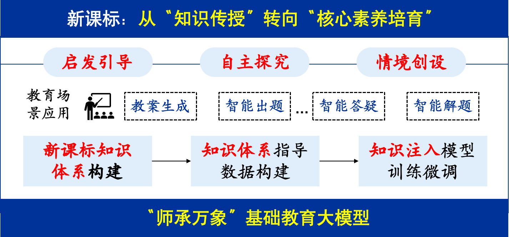

<div align="center">

<h1 style="font-size: 2.8em; margin-bottom: 0.5em;">师承万象教育大模型（MuduoLLM）</h1>
<h2 style="font-size: 1.8em; color: #666; margin-top: 0;">传承木铎金声，智启教育未来</h2>

</div>

<div align="center">

[](https://opensource.org/licenses/Apache-2.0)
[]()
[]()
[]()
[](https://huggingface.co/ERC-ITEA/MuduoLLM)


<!-- <div style="margin: 20px 0;">
&nbsp;&nbsp;&nbsp;&nbsp;
</div> -->

[🎓师承万象大模型公测平台](https://smartedu-bnu.tal.com/)  |  [🤗 模型开源链接](https://huggingface.co/ERC-ITEA/MuduoLLM)

</div>

# 目录

- [目录](#目录)
- [1. 简介](#1-简介)
- [2. 模型概述](#2-模型概述)
  - [2.1 技术路线](#21-技术路线)
  - [2.2 技术架构](#22-技术架构)
  - [2.3 训练环境](#23-训练环境)
- [3. 核心能力](#3-核心能力)
  - [3.1 教育专业能力](#31-教育专业能力)
  - [3.2 教育应用能力](#32-教育应用能力)
    - [📝 智能出题](#-智能出题)
    - [🤖 智能答疑](#-智能答疑)
    - [📚 教案生成](#-教案生成)
  - [3.3 通用能力（公开数据集）](#33-通用能力公开数据集)
- [4. 快速开始](#4-快速开始)
  - [4.1 环境要求](#41-环境要求)
  - [4.2 安装](#42-安装)
  - [4.3 使用示例](#43-使用示例)
  - [4.4 专业场景使用](#44-专业场景使用)
    - [📝 智能出题](#-智能出题-1)
    - [🤖 智能答疑](#-智能答疑-1)
    - [📚 教案生成](#-教案生成-1)
- [许可证](#许可证)
- [引用](#引用)
- [联系我们](#联系我们)

# 1. 简介

师承万象大模型（MuduoLLM）是北京师范大学和北京世纪好未来教育科技有限公司共同研发的首个紧扣新课标知识体系的基础教育大模型，确保所学知识内容与基础教育课程标准高度契合，精准对接学生核心素养培育与教师专业成长需求。在应用层面，基础教育大模型深度融合新课标理念，实现探究启发式智能答疑、素养导向型智能出题、情境沉浸式教案生成，从知识传授转向核心素养培育，助力培养全面发展时代新人。同时，师承万象大模型是当前性能表现较为突出的开源基础教育大模型之一，为开发者提供了可进一步优化的空间。

# 2. 模型概述

## 2.1 技术路线

师承万象大模型以新课标知识体系为核心全链贯穿，研发首个紧扣新课标的基础教育大模型，赋能教师专业成长，助力学生核心素养培育。

<div align="center">

</div>

在师承万象大模型研发过程中，研发团队联合教育专家与一线教师构建新课标知识体系，指导契合新课标的训练数据重构，并结合知识注入指令微调强化模型教育专业能力。

<div align="center">

</div>

## 2.2 技术架构

- **基础架构**：[Qwen2.5-14B-Instruct](https://huggingface.co/Qwen/Qwen2.5-14B-Instruct)
- **参数量**：140 亿（14B）
- **训练数据**：约400GB基础教育领域文本数据，包含出题、答疑、教案等针对性教育数据
- **训练方法**：
  - 教育领域继续预训练（Domain-specific Pretraining）：在通用模型基础上，注入教育领域专有语料强化语义理解
  - 监督微调（SFT, Supervised Fine-Tuning）：针对教育场景任务（智能出题/智能答疑/教案生成）进行定向优化
  - 直接偏好优化（DPO, Direct Preference Optimization）：通过教育专家人工标注偏好数据，提升生成内容的准确性与教育伦理合规性

## 2.3 训练环境  

- **硬件配置**：
  - 服务器数量：4台
  - GPU配置：每台8张 NVIDIA A800-SXM4-80GB（总计32张）
    - 单卡显存：80GB
    - 互联技术：NVLink 4.0（带宽9.6TB/s）
    - 并行策略：数据并行 + 张量并行
- **软件**：
  - 基础框架：
    - CUDA：12.4
    - PyTorch：2.5.1+cu124
  - 优化工具：
    - DeepSpeed：0.15.4（ZeRO-3优化器）
    - FlashAttention
    - 训练精度：bfloat16混合精度
  - 运行环境：Conda虚拟环境 + Weights & Biases监控
- **训练时长**：10天

# 3. 核心能力

## 3.1 教育专业能力

师承万象大模型针对初中数学、物理、化学三大理科科目进行专项优化，能够精准解析题目、提供清晰思路，并给出详细解答步骤。在同量级模型（14B）中，在新课标课程内容上具有最强的知识理解运用能力，深度适配新课标理念，对齐学科核心素养要求。

<div align="center">

</div>

<details>
<summary><b>数学学科能力</b></summary>


| 模型名         | 图形与几何 | 数与代数 | 统计与概率 | 综合与实践 |
|----------------|------------|----------|------------|------------|
| Qwen2.5-14B-instruct | 79.25      | 79.50    | 79.00      | 71.50      |
| DeepSeek-R1-Distill-Qwen-14B | 80.25      | 85.00    | 78.75      | 74.00      |
| Phi-4          | 69.25      | 74.00    | 75.25      | 59.25      |
| InternLM2-chat-Math-20B | 44.00      | 44.50    | 43.00      | 32.50      |
| Gemma3-12B     | 73.25      | 75.00    | 74.25      | 61.75      |
| GLM-9B-chat    | 57.00      | 61.75    | 58.25      | 48.50      |
| Baichuan2-13B-Chat | 33.75      | 41.75    | 35.25      | 31.00      |
| EduChat-base-002-13b | 15.75      | 18.00    | 19.50      | 16.50      |
| Confucius-o1   | 78.25      | 82.25    | 75.00      | 68.75      |
| Spark-lite     | 24.00      | 27.75    | 27.00      | 20.50      |
| **MuduoLLM**   | **87.00** | **90.50** | **88.50** | **81.00** | 

</details>

<details>
<summary><b>物理学科能力</b></summary>


| 模型名         | 实验探究 | 物质   | 能量   | 跨学科实践 | 运动和相互作用 |
|----------------|----------|--------|--------|------------|----------------|
| Qwen2.5-14B-instruct | 66.25    | 82.75  | 83.25  | 83.50      | 83.75          |
| DeepSeek-R1-Distill-Qwen-14B | 60.75    | 79.50  | 80.00  | 79.50      | 78.75          |
| Phi-4          | 44.75    | 66.25  | 71.00  | 64.25      | 65.50          |
| InternLM2-chat-Math-20B | 32.75    | 48.00  | 45.50  | 48.75      | 49.50          |
| Gemma3-12B     | 51.75    | 71.75  | 73.50  | 71.75      | 69.00          |
| GLM-9B-chat    | 54.00    | 76.25  | 74.00  | 76.25      | 75.00          |
| Baichuan2-13B-Chat | 24.75    | 40.50  | 42.50  | 41.25      | 45.75          |
| EduChat-base-002-13b | 22.50    | 25.25  | 25.50  | 31.00      | 28.25          |
| Confucius-o1   | 68.25    | 78.50  | 83.75  | 80.50      | 83.25          |
| Spark-lite     | 23.75    | 37.50  | 33.50  | 41.75      | 41.25          |
| **MuduoLLM**   | **78.00** | **94.50** | **93.00** | **93.50** | **92.50** |

</details>

<details>
<summary><b>化学学科能力</b></summary>


| 模型名         | 化学与社会·跨学科实践 | 物质的化学变化 | 物质的性质与应用 | 物质的组成与结构 | 科学探究与化学实验 |
|----------------|----------------------|----------------|------------------|------------------|--------------------|
| Qwen2.5-14B-instruct | 76.00                | 68.00          | 77.25            | 73.25            | 59.75              |
| DeepSeek-R1-Distill-Qwen-14B | 69.00                | 69.75          | 74.75            | 70.50            | 59.00              |
| Phi-4          | 58.25                | 52.00          | 59.00            | 53.00            | 34.75              |
| InternLM2-chat-Math-20B | 46.00                | 28.00          | 45.75            | 35.75            | 25.25              |
| Gemma3-12B     | 63.25                | 51.75          | 63.75            | 59.25            | 39.75              |
| GLM-9B-chat    | 69.75                | 62.00          | 71.75            | 67.25            | 55.50              |
| Baichuan2-13B-Chat | 30.75                | 26.75          | 36.00            | 28.75            | 19.25              |
| EduChat-base-002-13b | 33.75                | 14.50          | 29.50            | 21.75            | 17.00              |
| Confucius-o1   | 75.75                | 69.25          | 77.25            | 73.50            | 62.50              |
| Spark-lite     | 38.50                | 22.75          | 40.50            | 39.50            | 19.75              |
| **MuduoLLM**   | **91.50** | **84.00** | **91.50** | **91.00** | **81.00** |

</details>

## 3.2 教育应用能力

师承万象教育大模型 深度聚焦基础教育领域需求，紧密围绕新课标要求进行了全面优化与精准适配，目前已成熟支持教案生成、智能出题、智能答疑、智能解题等核心教育应用场景。通过前沿技术与教育教学的深度融合，该模型正持续为教育数字化转型注入创新动能，助力构建更智能、更高效的现代化教育生态。

### 📝 智能出题

<div align="center">

</div>

在同量级模型中，师承万象具备最强情境创设能力，可生成优质情境化题目，将抽象知识转化为真实可感的问题情境，提升实际问题解决能力。

<div align="center">

</div>

| 模型名         | 知识点匹配度 | 题型匹配度 | 题目准确性 | 解析准确性 | 素养导向性 | 均分 |
|----------------|------------------|----------------|----------------|----------------|----------------|--------------|
| Qwen2.5-14B-instruct | 97.00            | 94.00          | 87.33      | 76.67          | 23.50          | 75.70        |
| DeepSeek-R1-Distill-Qwen-14B | 96.67            | 64.00          | 66.50          | 70.33          | 27.50          | 65.00        |
| Phi-4          | 94.50            | 93.67          | 79.83          | 66.17          | 19.00          | 70.63        |
| InternLM2-chat-Math-20B | 81.00            | 58.67          | 55.33          | 31.33          | 19.17          | 49.10        |
| Gemma3-12B     | 94.00            | 75.83          | 65.50          | 53.33          | 33.67          | 64.47        |
| GLM-9B-chat    | 93.00            | 80.50          | 73.00          | 54.83          | 18.83          | 64.03        |
| Baichuan2-13B-Chat | 85.50            | 58.33          | 46.83          | 20.50          | 17.17          | 45.67        |
| EduChat-base-002-13b | 95.17            | 80.83          | 55.50          | 16.50          | 25.00          | 54.60        |
| Confucius-o1   | 97.17            | 83.17          | 81.33          | 72.83          | 31.67          | 73.23        |
| Spark-lite     | 78.67            | 71.67          | 51.83          | 20.50          | 14.50          | 47.43        |
| **MuduoLLM** | **99.00** | **98.83** | **88.33** | **83.67** | **36.00** | **81.17** |

<details>

<summary><b>数学学科出题能力</b></summary>

| 模型           | 知识点匹配度 | 题型匹配度 | 题目准确性 | 解析准确性 | 素养导向性 | 均分   |
|-------------------------------|--------------|------------|------------|------------|------------|--------|
| Qwen2.5-14B-instruct          | 98           | 90.5       | 89.5       | 82.5       | 8.5        | 73.8   |
| DeepSeek-R1-Distill-Qwen-14B  | 98           | 59.5       | 76         | 80.5       | 15.5       | 65.9   |
| Phi-4                         | 92.5         | 93         | 80.5       | 74.5       | 7          | 69.5   |
| InternLM2-chat-Math-20B       | 83.5         | 48.5       | 64.5       | 41.5       | 4          | 48.4   |
| Gemma3-12B                    | 93.5         | 61.5       | 69.5       | 69.5       | 11.5       | 61.1   |
| GLM-9B-chat                   | 89.5         | 82         | 73         | 53.5       | 7          | 61     |
| Baichuan2-13B-chat            | 79.5         | 56         | 53         | 22.5       | 8          | 43.8   |
| Educhat-sft-002-13b           | 94.5         | 82         | 72.5       | 29         | 21         | 59.8   |
| Confucius-o1                   | 96           | 79         | 87         | 80         | 12.5       | 70.9   |
| Spark-lite                    | 69.5         | 60.5       | 52         | 22.5       | 6.5        | 42.2   |
| MuduoLLM              | 98.5         | 98         | 90.5       | 87.5       | 12.5       | 77.4   |

</details>


<details>

<summary><b>物理学科出题能力</b></summary>


| 模型                | 知识点匹配度 | 题型匹配度 | 题目准确性 | 解析准确性 | 素养导向性 |   均分   |
|---------------------|--------------|------------|------------|------------|------------|----------|
| Qwen2.5-14B-instruct| 97           | 95         | 85.5       | 73         | 34.5       | 77       |
| DeepSeek-R1-Distill-Qwen-14B | 95.5       | 69.5       | 61.5       | 64         | 37.5       | 65.6     |
| Phi-4               | 95.5         | 94         | 79         | 63         | 31.5       | 72.6     |
| InternLM2-chat-Math-20B | 76         | 60         | 50         | 28.5       | 31.5       | 49.2     |
| Gemma3-12B          | 93           | 77         | 62         | 50         | 53         | 67       |
| GLM-9B-chat         | 93           | 81         | 74         | 50         | 28.5       | 65.3     |
| Baichuan2-13B-chat  | 85.5         | 59         | 44.5       | 17.5       | 28         | 46.9     |
| Educhat-sft-002-13b | 97           | 81.5       | 51.5       | 12.5       | 33         | 55.1     |
| Confucius-o1        | 98           | 80.5       | 73.5       | 66         | 43.5       | 72.3     |
| Spark-lite          | 80.5         | 71.5       | 55.5       | 22.5       | 19.5       | 49.9     |
| MuduoLLM            | 98.5         | 99         | 87         | 80.5       | 57.5       | 84.5     |

</details>

<details>

<summary><b>化学学科出题能力</b></summary>

| 模型                | 知识点匹配度 | 题型匹配度 | 题目准确性 | 解析准确性 | 素养导向性 |   均分   |
|---------------------|--------------|------------|------------|------------|------------|----------|
| Qwen2.5-14B-instruct| 96           | 96.5       | 87         | 74.5       | 27.5       | 76.3     |
| DeepSeek-R1-Distill-Qwen-14B | 96.5       | 63         | 62         | 66.5       | 29.5       | 63.5     |
| Phi-4               | 95.5         | 94         | 80         | 61         | 18.5       | 69.8     |
| InternLM2-chat-Math-20B | 83.5       | 67.5       | 51.5       | 24         | 22         | 49.7     |
| Gemma3-12B          | 95.5         | 89         | 65         | 40.5       | 36.5       | 65.3     |
| GLM-9B-chat         | 96.5         | 78.5       | 72         | 61         | 21         | 65.8     |
| Baichuan2-13B-chat  | 91.5         | 60         | 43         | 21.5       | 15.5       | 46.3     |
| Educhat-sft-002-13b | 94           | 79         | 42.5       | 8          | 21         | 48.9     |
| Confucius-o1        | 97.5         | 90         | 83.5       | 72.5       | 39         | 76.5     |
| Spark-lite          | 86           | 83         | 48         | 16.5       | 17.5       | 50.2     |
| MuduoLLM            | 100          | 99.5       | 87.5       | 83         | 38         | 81.6     |

</details>

### 🤖 智能答疑

<div align="center">

</div>

基于苏格拉底启发式教学法，通过多轮对话引导用户：
- 🎯 逐步深入思考
- 💡 自主发现问题
- 🧠 梳理逻辑关系
- 📚 澄清核心概念
- 🎓 掌握知识要点

在同量级模型中，师承万象具有最强的启发引导能力，分步讲解中可提供精准反馈与生成高质提问，促进深度思考，激发批判性思维。

<br>
<figure>
<div align="center">

</div>
</figure>


| 模型名         | 语言流畅 | 知识点正确 | 推理正确 | 合理反馈 | 导正话题 | 分步骤讲解 | 提问质量 | 引导质量 | 均分 |
|----------------|----------------|----------------|----------------|----------------|----------------|------------------|----------------|----------------|--------------|
| Qwen2.5-14B-instruct | 82.99          | 43.01          | 86.93          | 62.08          | 76.38          | 80.22            | 84.39          | 54.05          | 71.26        |
| DeepSeek-R1-Distill-Qwen-14B | 79.84          | 44.02          | **89.26**      | 75.04      | 28.91          | 15.85            | 28.72          | 50.84          | 51.56        |
| Phi-4          | 74.54          | 42.23          | 77.00          | 52.19          | 56.09          | 84.01            | 89.03          | 56.95          | 66.51        |
| InternLM2-chat-Math-20B | 47.76          | 41.65          | 61.28          | 30.38          | 33.31          | 29.93            | 3.83           | 8.09           | 32.03        |
| Gemma3-12B     | 87.74          | 32.85          | 73.61          | 64.77          | 80.42          | 77.09            | **95.37**      | 70.32          | 72.77        |
| GLM-9B-chat    | 76.62          | 44.52          | 82.82          | 65.49          | 36.82          | 66.76            | 84.94          | 68.56          | 65.82        |
| Baichuan2-13B-Chat | 71.14          | 41.61          | 74.05          | 30.66          | 15.17          | 60.76            | 23.84          | 17.89          | 41.89        |
| EduChat-base-002-13b | 87.90          | 38.37          | 71.55          | 26.63          | 38.49          | 50.66            | 55.15          | 18.11          | 48.36        |
| Confucius-o1   | 57.46          | 40.70          | 87.17          | 64.82          | 22.79          | 15.30            | 17.26          | 50.61          | 44.51        |
| Spark-lite     | 71.73          | 39.08          | 60.16          | 28.13          | 16.21          | 28.99            | 3.17           | 23.24          | 33.84        |
| **MuduoLLM**  | **89.09** | **82.26** | 88.83 | **77.57** | **96.97** | **90.28** | 91.77 | **74.34** | **86.39** |

<details>

<summary><b>数学学科答疑能力</b></summary>


| 模型                | 语言流畅 | 知识点正确 | 推理正确 | 合理反馈 | 导正话题 | 分步骤讲解 | 提问质量 | 引导质量 |    均分    |
|---------------------|----------|------------|----------|----------|----------|------------|----------|----------|------------|
| Qwen2.5-14B-instruct| 83.35    | 47.11      | 85.78    | 63.74    | 79.41    | 84.67      | 77.50    | 57.61    | 72.40      |
| DeepSeek-R1-Distill-Qwen-14B | 78.08   | 47.17      | 91.61    | 70.53    | 28.00    | 10.62      | 25.13    | 51.10    | 50.28      |
| Phi-4               | 76.41    | 44.67      | 80.33    | 54.00    | 57.00    | 86.33      | 87.30    | 67.00    | 69.13      |
| InternLM2-chat-Math-20B | 50.98   | 43.00      | 61.17    | 43.47    | 32.41    | 36.62      | 0.33     | 10.12    | 34.76      |
| Gemma3-12B          | 87.83    | 34.70      | 79.50    | 65.57    | 82.02    | 78.00      | 91.37    | 68.23    | 73.40      |
| GLM-9B-chat         | 81.09    | 47.39      | 75.30    | 65.70    | 37.26    | 77.27      | 84.47    | 65.09    | 66.70      |
| Baichuan2-13B-chat  | 68.39    | 42.30      | 71.16    | 31.59    | 11.96    | 57.37      | 12.38    | 20.13    | 39.41      |
| Educhat-sft-002-13b | 86.53    | 40.50      | 69.50    | 27.01    | 39.00    | 51.50      | 47.98    | 16.00    | 47.25      |
| Confucius-o1-14B    | 57.14    | 40.50      | 91.17    | 70.71    | 27.00    | 11.50      | 16.99    | 36.00    | 43.88      |
| Spark-lite          | 67.17    | 40.62      | 64.33    | 27.19    | 14.00    | 32.06      | 1.37     | 17.00    | 32.97      |
| MuduoLLM            | 88.41    | 80.07      | 84.33    | 76.63    | 97.84    | 88.00      | 87.87    | 74.48    | 84.70      |

</details>


<details>

<summary><b>物理学科答疑能力</b></summary>

| 模型                | 语言流畅 | 知识点正确 | 推理正确 | 合理反馈 | 导正话题 | 分步骤讲解 | 提问质量 | 引导质量 |    均分    |
|---------------------|----------|------------|----------|----------|----------|------------|----------|----------|------------|
| Qwen2.5-14B-instruct| 83.47    | 41.42      | 87.50    | 61.15    | 76.09    | 75.17      | 84.30    | 51.02    | 70.01      |
| DeepSeek-R1-Distill-Qwen-14B | 78.66   | 41.40      | 86.00    | 77.80    | 31.21    | 16.83      | 32.33    | 50.32    | 51.82      |
| Phi-4               | 74.44    | 41.44      | 79.83    | 51.00    | 57.00    | 83.78      | 91.03    | 50.00    | 66.07      |
| InternLM2-chat-Math-20B | 47.73   | 39.11      | 60.00    | 47.66    | 34.95    | 29.93      | 6.56     | 6.71     | 34.08      |
| Gemma3-12B          | 87.92    | 30.55      | 69.83    | 67.94    | 83.46    | 81.77      | 95.93    | 72.55    | 73.74      |
| GLM-9B-chat         | 77.93    | 46.80      | 88.33    | 66.28    | 39.21    | 67.50      | 88.27    | 66.72    | 67.63      |
| Baichuan2-13B-chat  | 70.66    | 40.20      | 78.00    | 31.58    | 12.00    | 66.44      | 29.57    | 17.00    | 43.18      |
| Educhat-sft-002-13b | 87.75    | 36.55      | 75.83    | 27.16    | 34.04    | 52.16      | 56.87    | 19.00    | 48.67      |
| Confucius-o1-14B    | 57.21    | 41.07      | 86.33    | 58.54    | 24.37    | 17.89      | 19.74    | 62.84    | 46.00      |
| Spark-lite          | 73.24    | 35.28      | 61.33    | 30.96    | 17.00    | 31.90      | 5.86     | 27.00    | 35.32      |
| MuduoLLM            | 89.43    | 81.49      | 91.67    | 80.67    | 95.27    | 90.50      | 92.96    | 75.87    | 87.23      |

</details>

<details>

<summary><b>化学学科答疑能力</b></summary>


| 模型                | 语言流畅 | 知识点正确 | 推理正确 | 合理反馈 | 导正话题 | 分步骤讲解 | 提问质量 | 引导质量 |    均分    |
|---------------------|----------|------------|----------|----------|----------|------------|----------|----------|------------|
| Qwen2.5-14B-instruct| 82.17    | 40.50      | 87.50    | 61.35    | 73.65    | 80.83      | 91.37    | 53.52    | 71.36      |
| DeepSeek-R1-Distill-Qwen-14B | 82.79   | 43.50      | 90.17    | 76.80    | 27.52    | 20.10      | 28.70    | 51.10    | 52.58      |
| Phi-4               | 72.77    | 40.59      | 70.83    | 51.58    | 54.26    | 81.93      | 88.77    | 53.85    | 64.32      |
| InternLM2-chat-Math-20B | 44.57   | 42.85      | 62.67    | 0.00     | 32.57    | 23.24      | 4.59     | 7.45     | 27.24      |
| Gemma3-12B          | 87.46    | 33.30      | 71.50    | 60.81    | 75.77    | 71.50      | 98.80    | 70.19    | 71.17      |
| GLM-9B-chat         | 70.84    | 39.38      | 84.83    | 64.49    | 34.00    | 55.50      | 82.09    | 73.86    | 63.12      |
| Baichuan2-13B-chat  | 74.38    | 42.34      | 73.00    | 28.82    | 21.56    | 58.46      | 29.57    | 16.54    | 43.08      |
| Educhat-sft-002-13b | 89.43    | 38.07      | 69.33    | 25.73    | 42.43    | 48.33      | 60.60    | 19.34    | 49.16      |
| Confucius-o1-14B    | 58.02    | 40.54      | 84.00    | 65.21    | 17.00    | 16.50      | 15.03    | 53.00    | 43.66      |
| Spark-lite          | 74.78    | 41.35      | 54.83    | 26.23    | 17.63    | 23.00      | 2.26     | 25.72    | 33.23      |
| MuduoLLM            | 89.42    | 85.21      | 90.50    | 75.41    | 97.81    | 92.33      | 94.50    | 72.66    | 87.23      |

</details>

### 📚 教案生成

<div align="center">

</div>

在同量级模型中，师承万象具有最强的自主学习激发能力，可生成探究式、协作式教学方案，助力培养以学生为中心的自主建构式学习意识。

<br>
<figure>
<div align="center">

</div>
</figure>


| 模型名         | 结构完整性 | 内容准确性 | 内容一致性 | 语言逻辑性 | 素养导向性 | 加权分 |
|----------------|------------------|------------------|------------------|------------------|----------------|--------------|
| Qwen2.5-14B-instruct | 80.22            | 54.13            | 88.35            | 87.30            | 70.05          | 75.97        |
| DeepSeek-R1-Distill-Qwen-14B | 80.70            | 64.31            | 89.55        | **89.70**        | 79.65          | 82.40        |
| Phi-4          | 54.00            | 34.24            | 67.80            | 72.75            | 83.85          | 54.39        |
| InternLM2-chat-Math-20B | 58.71            | 32.06            | 67.80            | 60.75            | 68.55          | 52.96        |
| Gemma3-12B     | 80.37            | 63.79            | 89.40            | **89.70**        | 81.90          | 82.17        |
| GLM-9B-chat    | 78.42            | 50.01            | 88.50            | 84.15            | 79.05          | 73.61        |
| Baichuan2-13B-Chat | 64.86            | 35.57            | 75.00            | 77.25            | 71.25          | 59.02        |
| EduChat-base-002-13b | 47.58            | 31.86            | 31.20            | 41.25            | 58.50          | 43.86        |
| Confucius-o1   | 81.75            | 65.57            | **89.70**        | 89.40            | 76.65          | 83.21        |
| Spark-lite     | 71.67            | 37.71            | 67.95            | 66.30            | 79.80          | 61.96        |
| **MuduoLLM**  | **83.76** | **71.53** | 88.20 | 87.00 | **84.75** | **87.36** |

<details>

<summary><b>数学学科教案生成能力</b></summary>

| 模型                | 结构完整性 | 内容准确性 | 内容一致性 | 语言逻辑性 | 素养导向性 | 加权分   |
|---------------------|------------|------------|------------|------------|------------|----------|
| Qwen2.5-14B-instruct| 85.90      | 60.79      | 98.00      | 99.00      | 64.50      | 74.43    |
| DeepSeek-R1-Distill-Qwen-14B | 87.90     | 72.14      | 100.00     | 100.00     | 76.50      | 81.37    |
| Phi-4               | 57.60      | 36.86      | 74.00      | 92.00      | 91.00      | 53.53    |
| InternLM2-chat-Math-20B | 63.90     | 34.14      | 72.50      | 68.50      | 55.50      | 50.30    |
| Gemma3-12B          | 86.90      | 70.07      | 99.00      | 100.00     | 79.00      | 80.17    |
| GLM-9B-chat         | 82.10      | 51.71      | 97.50      | 97.00      | 83.50      | 70.00    |
| Baichuan2-13B-chat  | 68.70      | 34.64      | 82.00      | 91.50      | 68.00      | 55.17    |
| Educhat-sft-002-13b | 47.40      | 27.79      | 28.00      | 50.00      | 52.00      | 37.47    |
| Confucius-o1-14B    | 88.70      | 72.57      | 99.50      | 99.50      | 67.00      | 81.17    |
| Spark-lite          | 73.60      | 36.36      | 63.00      | 73.50      | 85.00      | 56.27    |
| MuduoLLM            | 89.50      | 73.00      | 98.50      | 98.50      | 85.50      | 82.70    |

</details>


<details>

<summary><b>物理学科教案生成能力</b></summary>

| 模型                | 结构完整性 | 内容准确性 | 内容一致性 | 语言逻辑性 | 素养导向性 | 加权分   |
|---------------------|------------|------------|------------|------------|------------|----------|
| Qwen2.5-14B-instruct| 91.50      | 63.07      | 99.50      | 97.00      | 87.50      | 78.87    |
| DeepSeek-R1-Distill-Qwen-14B | 89.90     | 72.07      | 99.50      | 99.50      | 96.50      | 83.30    |
| Phi-4               | 63.30      | 40.64      | 87.50      | 81.50      | 95.50      | 57.73    |
| InternLM2-chat-Math-20B | 65.90     | 40.57      | 90.00      | 72.50      | 91.50      | 57.87    |
| Gemma3-12B          | 91.50      | 75.93      | 100.00     | 100.00     | 97.50      | 85.73    |
| GLM-9B-chat         | 89.90      | 60.50      | 100.00     | 95.00      | 94.50      | 77.50    |
| Baichuan2-13B-chat  | 75.70      | 44.36      | 89.00      | 88.00      | 89.00      | 63.63    |
| Educhat-sft-002-13b | 58.60      | 41.36      | 46.50      | 50.50      | 75.00      | 50.30    |
| Confucius-o1-14B    | 93.20      | 76.93      | 100.00     | 99.50      | 96.00      | 86.63    |
| Spark-lite          | 83.40      | 46.29      | 87.50      | 77.50      | 91.00      | 66.47    |
| MuduoLLM            | 96.00      | 84.50      | 98.50      | 97.00      | 99.50      | 91.10    |

</details>

<details>

<summary><b>化学学科教案生成能力</b></summary>

| 模型                | 结构完整性 | 内容准确性 | 内容一致性 | 语言逻辑性 | 素养导向性 | 加权分   |
|---------------------|------------|------------|------------|------------|------------|----------|
| Qwen2.5-14B-instruct| 90.00      | 56.57      | 97.00      | 95.00      | 81.50      | 74.60    |
| DeepSeek-R1-Distill-Qwen-14B | 91.20     | 70.14      | 99.00      | 99.50      | 92.50      | 82.53    |
| Phi-4               | 59.10      | 36.64      | 64.50      | 69.00      | 93.00      | 51.90    |
| InternLM2-chat-Math-20B | 65.90     | 32.14      | 63.50      | 61.50      | 81.50      | 50.70    |
| Gemma3-12B          | 89.50      | 66.64      | 99.00      | 99.00      | 96.50      | 80.60    |
| GLM-9B-chat         | 89.40      | 54.50      | 97.50      | 88.50      | 85.50      | 73.33    |
| Baichuan2-13B-chat  | 71.80      | 39.57      | 79.00      | 78.00      | 80.50      | 58.27    |
| Educhat-sft-002-13b | 52.60      | 37.07      | 29.50      | 37.00      | 68.00      | 43.80    |
| Confucius-o1-14B    | 90.60      | 69.07      | 99.50      | 99.00      | 92.50      | 81.83    |
| Spark-lite          | 81.90      | 43.07      | 76.00      | 70.00      | 90.00      | 63.13    |
| MuduoLLM            | 93.70      | 80.93      | 97.00      | 94.50      | 97.50      | 88.27    |

</details>

## 3.3 通用能力（公开数据集）

<div align="center">

</div>

在专注教育领域的同时，师承万象依然保持着强大的通用能力，能够流畅应对日常交流、知识问答、创意生成等多样化需求。无论是闲聊互动、学习辅助，还是实用信息查询、解题，它都能以精准的理解和自然的表达提供帮助。


| 模型                | IFEval | CEval | MMLU  | MMLU_PRO | GPQA  | CMMLU | HalluQA-main |   均分   |
|---------------------|--------|--------|-------|----------|-------|-------|-------------|----------|
| Qwen2.5-14B-instruct | 78.45  | **82.37**  | 78.13 | 64.02    | 46.46 | 80.19 | 62.22       | 70.26    |
| DeepSeek-R1-Distill-Qwen-14B | 71.9   | 67.38  | **86.08** | 73.23    | **55.56** | 81.77 | 43.56       | 68.50    |
| Phi-4               | 60.81  | 63.26  | 85.92 | 72.9     | **55.56** | 65.03 | 18.67       | 60.31    |
| InternLM2-chat-Math-20B | 77.63  | 80.37  | 38.53 | 22.11    | 30.81 | 61.24 | 29.78       | 48.64    |
| Gemma3-12B          | **81.7**   | 58.22  | 78.54 | **76.51**    | 36.36 | 61.39 | 28.67       | 60.20    |
| GLM-9B-chat         | 81.89  | 70.67  | 71.66 | 46.14    | 30.3  | 70.39 | 38.00       | 58.44    |
| Baichuan2-13B-Chat   | 12.38  | 55.43  | 12.66 | 16.62    | 5.05  | 59.93 | 24.44       | 26.64    |
| Educhat-sft-002-13b | 35.12  | 42.39  | 24.61 | 12.06    | 12.12 | 42.82 | 15.56       | 26.38    |
| Confucius-o1        | 60.26  | 78.31  | 74.05 | 49.2     | 38.38 | **83.49** | 54.67       | 62.62    |
| Spark-lite          | 7.76   | 31.83  | 28.31 | 17.64    | 25.25 | 30.16 | 13.62       | 22.08    |
| **MuduoLLM**            | 75.97  | 81.88  | 84.66 | 67.43    | 45.96 | 82.33 | **73.67**       | **73.13**    |

# 4. 快速开始

## 4.1 环境要求

- Python 3.10
- PyTorch
- transformers >= 4.37.0

## 4.2 安装

```bash
# 克隆仓库
huggingface-cli download --resume-download ERC-ITEA/MuduoLLM --local-dir ./muduo-llm/

# 创建环境
conda create --name muduo python=3.10
conda activate muduo

# 安装依赖
pip install transformers
```

## 4.3 使用示例

```python
from transformers import AutoModelForCausalLM, AutoTokenizer

# 加载模型和分词器
model_name = "MuduoLLM"
model = AutoModelForCausalLM.from_pretrained(
    model_name,
    torch_dtype="auto",
    device_map="auto"
)
tokenizer = AutoTokenizer.from_pretrained(model_name)

# 准备输入
prompt = "Give me a short introduction to large language model." ### 给一个教育领域的prompt
messages = [
    {"role": "system", "content": "你是北京师范大学和好未来开发的人工智能语言模型，名为师承万象。可以回答问题、提供信息、进行对话并帮助解决问题。"},
    {"role": "user", "content": prompt}
]

# 生成回复
text = tokenizer.apply_chat_template(
    messages,
    tokenize=False,
    add_generation_prompt=True
)
model_inputs = tokenizer([text], return_tensors="pt").to(model.device)

generated_ids = model.generate(
    **model_inputs,
    max_new_tokens=512
)
generated_ids = [
    output_ids[len(input_ids):] for input_ids, output_ids in zip(model_inputs.input_ids, generated_ids)
]

response = tokenizer.batch_decode(generated_ids, skip_special_tokens=True)[0]
```

## 4.4 专业场景使用

### 📝 智能出题

```python
system_prompt = """你是一个教育专家，擅长根据用户需求给出新的题目，要求如下。
1. 所出题目要与用户要求知识点相匹配。
2. 所出题目要符合用户所要求的年段或年级。
3. 需要给出详细的解题步骤与最终答案。
4. 不要出现与图像相关的题目，例如"如图"等字样。
5. 答案部分直接给出最终答案，不要出现额外的内容。且答案不能直接用"见解析"等字样代替。
请按照以下格式输出回答：
<题目>{题目}</题目>
<解析>{解析}</解析>
<答案>{答案}</答案>"""

user_prompt = """我是一名化学老师，学生反馈溶质质量计算这个部分总是搞不懂，能不能用给我一道合适的解答题？适合初中生，好让学生能更好理解。"""
```

### 🤖 智能答疑

```python
system_prompt = """我是一个学生，请你扮演一位苏格拉底式答疑的老师。与我进行多轮对话，遵守以下规则，对我的问题进行引导式解答：
        - 在第一次回复时对题目知识点简要说明。
        - 始终保持对话自然流畅，让交流富有逻辑性和互动性。
        - 不要直接给出答案或完整解题步骤，而是通过提问引导我思考。
        - 每次只提出一个引导性问题，问题应基于我的回答情况，帮助我逐步接近正确答案。
        - 如果我一直表现出不理解，应该调整讲解方式，提供进一步的解释或更基础的问题。
        - 答疑过程中，应确保最终引导我得出正确答案，而不是在中途终止推理。
        - 答疑过程中对我的提问要明确回答，要提醒用户回归对话主题
        - 在通过一步步推理得到答案之前，不能结束对话。
        答疑结束条件：
        - 你在得出完整的正确答案的回复中消息：
            * 避免突然结束，确保有完整的认知闭环
            * 明确说出正确答案（如"正确答案为...""本题答案为..."等）

user_prompt = """若$$y = 1$$是方程$$2 - \frac { 1 } { 3 } ( m - y ) = 2 y$$的解, 求关于x的方程 m(x-$$3 ) - 2 = m(2 x - 5)$$的解."""
```

### 📚 教案生成

```python
system_prompt = """你是一位经验丰富的教学助手，请根据用户指令生成教案；你只需要输出教案，禁止输出其他内容。"""

user_prompt = """请帮我生成初中数学中一元二次方程的教案."""
```


# 许可证

本项目采用 [Apache 2.0](https://opensource.org/licenses/Apache-2.0) 许可证。

本项目仅供研究目的使用，项目开发者对于使用本项目（包括但不限于数据、模型、代码等）所导致的任何危害或损失不承担责任。

# 引用

```bibtex
@misc{shi-cheng-wan-xiang-2025,
  title={MuduoLLM: A High-Performance LLM for Intelligent Education Solutions},
  author={MuduoLLM Contributors from BNU and TAL},
  year={2025},
  howpublished={\url{https://huggingface.co/ERC-ITEA/MuduoLLM}},
}
```

# 联系我们
